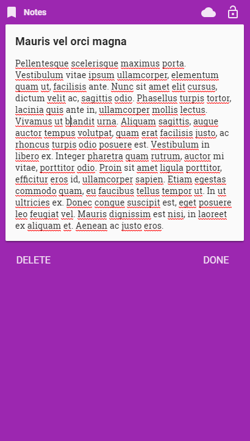
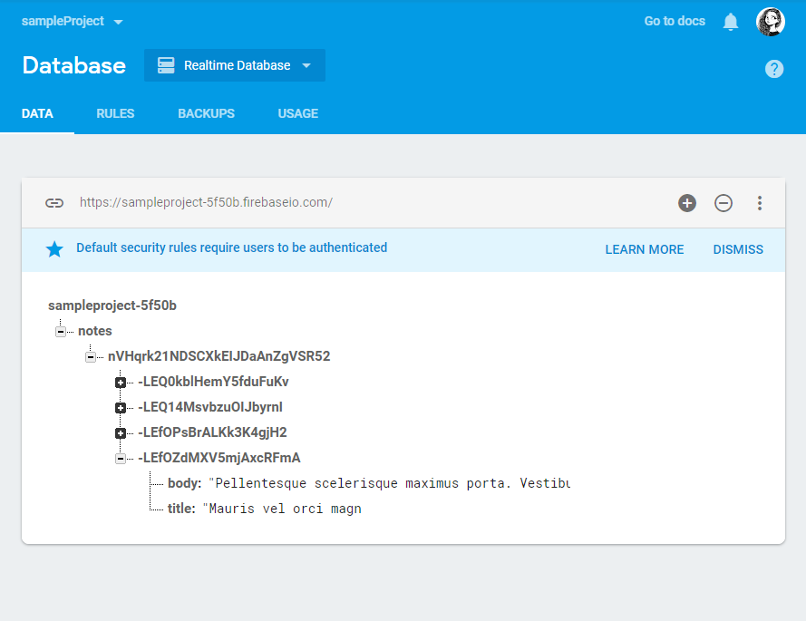

# Progessive Web APP - notes  
This project focuses on a basic introduction on how to build a Progressive Web APP (PWA) which brings more reliability, effectiveness, and engagement to the user compare to a regular app. A PWA brings all the benefits of a regular app, from a full screen immersive experience to push notifications. It also does not require of a network state that is constantly online to launch the PWA or display the user’s data in a matter of seconds. 
The use of Firebase web components allows the PWA to have a better managing infrastructure that is simple to use. It also generates all of the API keys that are needed by the PWA to add user authentication and backend database, use to store all of the user data in the firebase server. 
Polymer library allows the usage of web components, service workers and JavaScript development. The main purpose of using this library is to allow the browser to do most of the work that other libraries usually would be doing.  Polymer is compatible with all of the major browsers making facilitating the development of PWAs.

  
  

## Building PWA
Using the tutorial created by Google I was able to build a Progressive Web App for notes. The PWA created in this project has the functionality to take notes on the browser and most importantly on mobile. The user capable of creating, editing, and deleting notes which sync to the user’s Google account to store the data to the server. Using this PWA facilitates the usage, accessibility and shareability of the app with others.
We start by installing Node.js, Git, and creating a new project with Firebase. Once Node.js was installed I used the NPM to install the Bower manager package that is used to install other dependencies for the browser later on.  I also needed to install the Firebase CLI which is used to connect and deploy my PWA with Firebase.

Screenshot of the Firebase CLI being initialized

  

The following screenshots show the ability of the user creating and editing notes in the PWA

  
  

<!-- 
-->

Realtime server using Firebase, use to store all the information from the PWA

  

<!---->

## Future Additions
I consider this project a good start to explore and learn more about PWAs. I will be playing around with this app for a while since I have a few ideas on how to improve it. I would like to add a feature that allows each user to same their own app theme. Another feature that allows the user to upload a picture with their notes and maybe edit that picture. I have also an idea of adding a timestamp of the last edit, it could be important if the user decides to use the app as a journal. There many great things to be done with this app and cannot wait to make them all happen.

## Conclusion
This project was simple but served its purpose of having a good introduction to PWA, web components, polymer, service workers, and Firebase. I learned a lot about web technology that Google, and other companies have been working on for years in order to bring a better service to users when using the web and apps on their phones. I have heard of PWAs previous to this class since I watched Google I/O every year however I did not realize how useful and fast they were until this project.
My project can be found by following this link https://sampleproject-5f50b.firebaseapp.com/. If you are on mobile you have the option to add it to your home screen and explore all the wonders of PWA for yourself.
